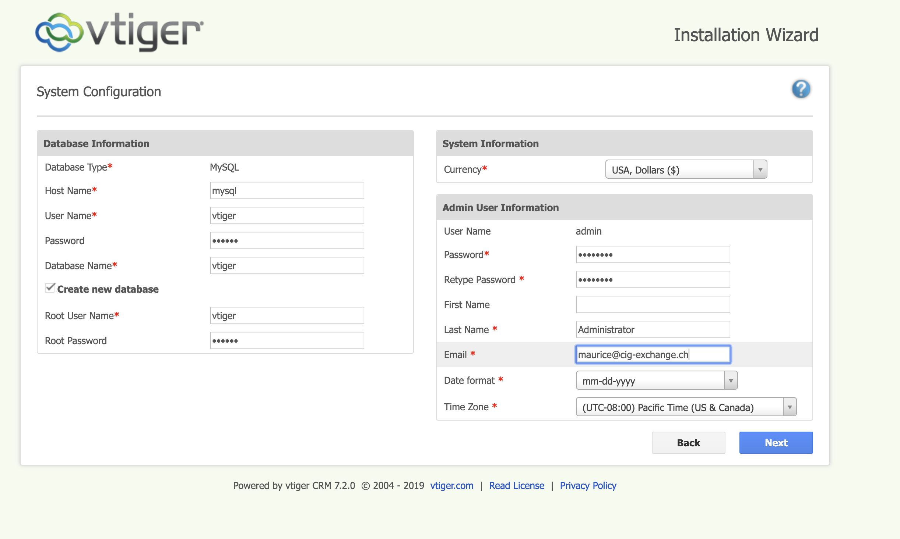

# Requirement

You need docker-proxy. You can download it here:

https://github.com/mauricext4fs/docker-proxy

git clone https://github.com/mauricext4fs/docker-proxy.git

# Setting

Vtiger will run on the hostname you provide in .env on port 
443 (SSL). Port 80 will redirect to https://your.domain. 
Therefore, you must own an SSL certificate for that domain.
Two files are required (NGINX SSL default config). First 
one is the key file (etc/ssl/ninezh.cc.key) containing the private key used to sign 
the csr... the certificate is signed with that key. The 
second file is the crt file (ex: etc/ssl/ninezh.cc.crt).

For easy of use you should just overwrite the ninezh.cc* files 
directly in etc/ssl*. However if you really fancy setting 
the proper name to your SSL certificate beaware that you 
must change the volume definition in docker-compose.yml 
as well as the name of the files on disk.

# INSTALL

- open .env change vtiger.ninezh.cc for your hostname
- run sudo ./configure

Now go to https://thedomainyourwrotein.env
to initialize Vtiger.

Full config including MySQL authentication  are shown 
in this screenshot below:



username: vtiger
pass: vtiger
hostname: mysql (it run inside docker namespace... you cannot access 
	  this database directly without passing by docker as the port
	  mapping as been disabled for security reason).
database: your choice but don't forget to click on "Create new database".

# MySQL

If you wish to connect to the mysql DB for your vTiger installation be aware that the root password 
is randomly generated and only shown once at the first run. If you are lucky you can see it when 
running: 

```sh
docker-compose logs mysql | grep "GENERATED ROOT PASSWORD"
```

To access the database with the mysql cli use:

```sh
docker-compose exec mysql mysql -u vtiger -p vtiger
```
The password is simply: vtiger


Enjoy!
